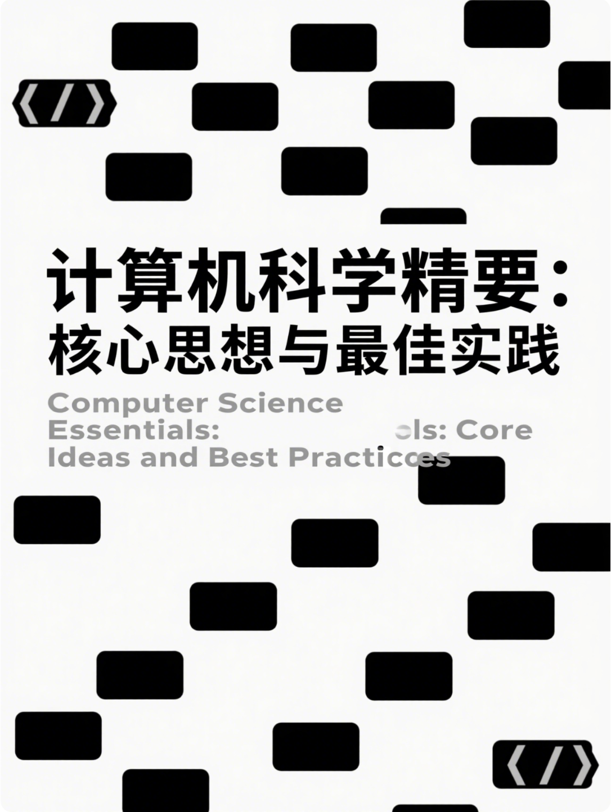

# 计算机科学精要：核心思想与最佳实践  

> Computer Science Essentials: Core Ideas and Best Practices,2025

AI天才研究院 编著

AI Genius Institute, 2025

# 慷慨捐赠：AI天才研究院

> 您的慷慨捐赠，将帮助我们持续为读者提供高质量的内容。
> 
> Donate to AI Genius Institute Generously，and we will continue to provide high-quality content for readers.

| 微信                                                    | 支付宝                                                  |
| ------------------------------------------------------- | ------------------------------------------------------- |
|  |  |

---

# 《计算机科学精要：核心思想与最佳实践》 

> Computer Science Essentials: Core Ideas and Best Practices
> 
> AI天才研究院 编著

---

# 前言

# 推荐序

# 内容简介

# 第一部分：计算机科学基础

# 第1章：计算机科学概论

## 1.1 计算机科学的本质与发展史
### 1.1.1 计算机科学的定义与范畴
### 1.1.2 计算理论的发展历程
### 1.1.3 计算机科学的学科划分

## 1.2 计算思维与问题解决
### 1.2.1 计算思维的核心要素
### 1.2.2 问题形式化与抽象化
### 1.2.3 分解与模式识别

## 1.3 计算机科学的经典书籍概览
### 1.3.1 理论计算机科学经典著作
### 1.3.2 系统与架构类经典著作
### 1.3.3 编程与工程类经典著作

## 1.4 学习计算机科学的方法论
### 1.4.1 自顶向下与自底向上的学习方法
### 1.4.2 理论与实践的结合
### 1.4.3 构建个人知识体系的策略

# 第2章：计算理论基础

## 2.1 计算模型与可计算性
### 2.1.1 图灵机与Church-Turing论题
### 2.1.2 可计算性与不可计算性
### 2.1.3 停机问题与哥德尔不完备定理

## 2.2 复杂度理论
### 2.2.1 时间复杂度与空间复杂度
### 2.2.2 问题复杂度分类：P、NP与NP完全
### 2.2.3 复杂度分析在实际问题中的应用

## 2.3 形式语言与自动机
### 2.3.1 正则语言与有限自动机
### 2.3.2 上下文无关语言与下推自动机
### 2.3.3 形式语言分类及其在编程语言中的应用

## 2.4 信息论基础
### 2.4.1 信息量与熵的概念
### 2.4.2 数据压缩与编码理论
### 2.4.3 信息论在计算机科学中的应用

# 第二部分：数据结构与算法

# 第3章：数据结构基础

## 3.1 抽象数据类型与封装
### 3.1.1 数据抽象的概念与优势
### 3.1.2 抽象数据类型的定义与实现
### 3.1.3 接口与实现分离的设计思想

## 3.2 线性数据结构
### 3.2.1 数组与链表的本质与实现
### 3.2.2 栈与队列的应用场景
### 3.2.3 哈希表的原理与冲突解决策略

## 3.3 树形数据结构
### 3.3.1 二叉树与二叉搜索树
### 3.3.2 平衡树：AVL树与红黑树
### 3.3.3 B树与B+树在数据库中的应用

## 3.4 图结构
### 3.4.1 图的表示方法：邻接矩阵与邻接表
### 3.4.2 图的遍历：深度优先与广度优先
### 3.4.3 最短路径与最小生成树算法

# 第4章：算法设计与分析

## 4.1 算法分析基础
### 4.1.1 渐近符号与增长率
### 4.1.2 最坏、平均与最佳情况分析
### 4.1.3 递归方程与求解方法

## 4.2 算法设计范式
### 4.2.1 分治法：归并排序与快速排序
### 4.2.2 动态规划：最优子结构与重叠子问题
### 4.2.3 贪心算法：局部最优与全局最优

## 4.3 高级算法主题
### 4.3.1 图算法：最短路径与网络流
### 4.3.2 字符串算法：模式匹配与编辑距离
### 4.3.3 近似算法与启发式算法

## 4.4 算法优化与性能调优
### 4.4.1 空间与时间的权衡
### 4.4.2 缓存感知算法
### 4.4.3 并行与分布式算法

# 第5章：算法思想与应用案例

## 5.1 排序算法的本质
### 5.1.1 比较排序的理论极限
### 5.1.2 非比较排序的应用场景
### 5.1.3 排序算法在实际系统中的选择

## 5.2 搜索算法的本质
### 5.2.1 二分查找及其变种
### 5.2.2 树与图的搜索策略
### 5.2.3 启发式搜索与A*算法

## 5.3 算法在人工智能中的应用
### 5.3.1 机器学习中的优化算法
### 5.3.2 神经网络中的反向传播算法
### 5.3.3 强化学习中的动态规划方法

## 5.4 数据密集型应用中的算法
### 5.4.1 大数据处理的MapReduce模式
### 5.4.2 数据流算法与近似计算
### 5.4.3 外部排序与外部存储算法

# 第三部分：计算机系统与体系结构

# 第6章：计算机组成原理

## 6.1 计算机系统抽象层次
### 6.1.1 从晶体管到计算机系统
### 6.1.2 计算机体系结构的发展历程
### 6.1.3 现代计算机系统的组成部分

## 6.2 指令集架构
### 6.2.1 CISC与RISC架构的比较
### 6.2.2 x86与ARM指令集特点
### 6.2.3 指令执行过程与流水线

## 6.3 存储层次结构
### 6.3.1 高速缓存的工作原理
### 6.3.2 虚拟内存与地址映射
### 6.3.3 内存一致性与缓存一致性

## 6.4 I/O系统与总线
### 6.4.1 总线结构与协议
### 6.4.2 I/O设备的控制方式
### 6.4.3 DMA与中断处理

# 第7章：操作系统原理

## 7.1 操作系统的核心概念
### 7.1.1 操作系统的演化与分类
### 7.1.2 操作系统的设计目标与架构
### 7.1.3 微内核与宏内核的比较

## 7.2 进程与线程
### 7.2.1 进程模型与线程模型
### 7.2.2 上下文切换与调度算法
### 7.2.3 进程间通信机制

## 7.3 内存管理
### 7.3.1 物理内存与虚拟内存管理
### 7.3.2 分页与分段
### 7.3.3 页面置换算法

## 7.4 文件系统
### 7.4.1 文件系统的抽象与实现
### 7.4.2 目录结构与索引方法
### 7.4.3 现代文件系统的设计理念

## 7.5 并发与同步
### 7.5.1 临界区问题与互斥算法
### 7.5.2 死锁的条件与解决方案
### 7.5.3 信号量与监视器

# 第8章：编译原理与程序执行

## 8.1 编译器结构
### 8.1.1 编译过程的各个阶段
### 8.1.2 前端与后端分离设计
### 8.1.3 现代编译器架构

## 8.2 词法分析与语法分析
### 8.2.1 正则表达式与有限自动机
### 8.2.2 上下文无关文法与解析方法
### 8.2.3 语法制导的翻译

## 8.3 语义分析与中间代码生成
### 8.3.1 类型检查与类型推断
### 8.3.2 符号表设计与作用域处理
### 8.3.3 中间表示形式与三地址码

## 8.4 代码优化与目标代码生成
### 8.4.1 机器无关优化技术
### 8.4.2 指令选择与寄存器分配
### 8.4.3 并行性与流水线优化

## 8.5 运行时系统
### 8.5.1 程序装载与链接过程
### 8.5.2 内存布局与调用约定
### 8.5.3 垃圾回收机制与内存管理

# 第9章：分布式系统原理

## 9.1 分布式系统基础
### 9.1.1 分布式系统的特性与挑战
### 9.1.2 时间与事件顺序
### 9.1.3 分布式系统的设计原则

## 9.2 分布式通信
### 9.2.1 远程过程调用与消息传递
### 9.2.2 分布式对象与组件模型
### 9.2.3 发布-订阅模式与事件驱动架构

## 9.3 分布式一致性
### 9.3.1 CAP理论与BASE理论
### 9.3.2 一致性模型与实现
### 9.3.3 共识算法：Paxos与Raft

## 9.4 分布式容错
### 9.4.1 故障模型与故障检测
### 9.4.2 复制与分片策略
### 9.4.3 分布式事务与恢复机制

# 第四部分：编程语言与范式

# 第10章：编程语言理论

## 10.1 编程语言的演化与分类
### 10.1.1 编程语言的发展历程
### 10.1.2 命令式、函数式与逻辑式范式
### 10.1.3 静态与动态类型语言

## 10.2 语言设计的核心概念
### 10.2.1 语法、语义与语用
### 10.2.2 抽象机制与模块化
### 10.2.3 类型系统与类型理论

## 10.3 编程语言的实现方式
### 10.3.1 编译型与解释型语言
### 10.3.2 虚拟机与即时编译
### 10.3.3 语言运行时系统设计

## 10.4 程序语言的形式化方法
### 10.4.1 操作语义与指称语义
### 10.4.2 λ演算与函数式语言
### 10.4.3 程序验证与类型检查

# 第11章：函数式编程思想

## 11.1 函数式编程的核心理念
### 11.1.1 纯函数与副作用
### 11.1.2 不可变性与引用透明
### 11.1.3 函数式编程与数学基础

## 11.2 函数一等公民
### 11.2.1 高阶函数与闭包
### 11.2.2 部分应用与柯里化
### 11.2.3 函数组合与管道

## 11.3 函数式数据结构
### 11.3.1 持久化数据结构
### 11.3.2 惰性求值与无限结构
### 11.3.3 模式匹配与代数数据类型

## 11.4 函数式编程与并发
### 11.4.1 不可变性与并发安全
### 11.4.2 Actor模型与消息传递
### 11.4.3 函数式响应式编程

# 第12章：面向对象编程思想

## 12.1 面向对象的核心概念
### 12.1.1 封装、继承与多态
### 12.1.2 类与对象的关系
### 12.1.3 面向对象的设计原则

## 12.2 对象模型与类型系统
### 12.2.1 类-实例模型与原型模型
### 12.2.2 静态与动态类型检查
### 12.2.3 接口与抽象类

## 12.3 面向对象设计方法
### 12.3.1 职责驱动设计
### 12.3.2 UML与面向对象建模
### 12.3.3 设计模式在面向对象中的应用

## 12.4 面向对象编程的演化
### 12.4.1 从过程式到面向对象
### 12.4.2 混合范式编程
### 12.4.3 面向对象在现代语言中的表现

# 第五部分：软件工程与设计

# 第13章：软件工程方法论

## 13.1 软件开发生命周期
### 13.1.1 传统瀑布模型与迭代开发
### 13.1.2 敏捷方法与精益开发
### 13.1.3 DevOps与持续集成/持续部署

## 13.2 需求工程
### 13.2.1 需求获取与分析技术
### 13.2.2 需求建模与规格说明
### 13.2.3 需求验证与管理

## 13.3 软件设计原则
### 13.3.1 模块化与信息隐藏
### 13.3.2 高内聚与低耦合
### 13.3.3 可测试性与可维护性设计

## 13.4 软件质量保障
### 13.4.1 软件测试策略与方法
### 13.4.2 代码审查与静态分析
### 13.4.3 质量度量与持续改进

# 第14章：设计模式与架构

## 14.1 设计模式基础
### 14.1.1 设计模式的历史与分类
### 14.1.2 模式语言与模式体系
### 14.1.3 反模式与模式应用原则

## 14.2 创建型模式
### 14.2.1 单例模式与工厂模式
### 14.2.2 建造者模式与原型模式
### 14.2.3 依赖注入与控制反转

## 14.3 结构型模式
### 14.3.1 适配器模式与桥接模式
### 14.3.2 装饰器模式与代理模式
### 14.3.3 组合模式与享元模式

## 14.4 行为型模式
### 14.4.1 观察者模式与策略模式
### 14.4.2 命令模式与责任链模式
### 14.4.3 迭代器模式与访问者模式

## 14.5 架构模式与风格
### 14.5.1 分层架构与微服务架构
### 14.5.2 事件驱动架构与数据中心架构
### 14.5.3 领域驱动设计与六边形架构

# 第15章：代码质量与重构

## 15.1 代码质量的度量与评估
### 15.1.1 代码质量指标
### 15.1.2 代码复杂度分析
### 15.1.3 技术债务管理

## 15.2 代码整洁之道
### 15.2.1 命名与代码格式
### 15.2.2 函数设计原则
### 15.2.3 注释与文档策略

## 15.3 代码重构技术
### 15.3.1 重构的动机与时机
### 15.3.2 常见代码异味与重构手法
### 15.3.3 安全重构的方法与实践

## 15.4 测试驱动开发
### 15.4.1 TDD的核心原则与流程
### 15.4.2 单元测试与模拟对象
### 15.4.3 行为驱动开发与验收测试

# 第六部分：数据管理与系统

# 第16章：数据库系统原理

## 16.1 数据模型与查询语言
### 16.1.1 关系模型与SQL
### 16.1.2 文档模型与NoSQL
### 16.1.3 图模型与图查询语言

## 16.2 事务处理
### 16.2.1 ACID属性与实现机制
### 16.2.2 并发控制与锁机制
### 16.2.3 分布式事务与BASE理论

## 16.3 数据库存储与索引
### 16.3.1 数据文件组织与访问方法
### 16.3.2 索引结构：B+树与哈希索引
### 16.3.3 列式存储与压缩技术

## 16.4 查询处理与优化
### 16.4.1 SQL执行计划生成与评估
### 16.4.2 查询优化策略与统计信息
### 16.4.3 物化视图与查询缓存

# 第17章：大数据处理系统

## 17.1 大数据技术概述
### 17.1.1 大数据的特征与挑战
### 17.1.2 大数据生态系统
### 17.1.3 数据密集型计算原则

## 17.2 分布式文件系统
### 17.2.1 HDFS架构与设计原则
### 17.2.2 一致性与可用性权衡
### 17.2.3 复制策略与容错机制

## 17.3 批处理系统
### 17.3.1 MapReduce模型与实现
### 17.3.2 DAG执行引擎
### 17.3.3 资源管理与调度

## 17.4 流处理系统
### 17.4.1 流处理模型与窗口操作
### 17.4.2 状态管理与容错机制
### 17.4.3 实时与近实时处理系统比较

## 17.5 数据仓库与分析
### 17.5.1 OLAP与多维数据模型
### 17.5.2 ETL过程与数据集成
### 17.5.3 数据可视化与业务智能

# 第18章：计算机网络原理

## 18.1 网络分层体系结构
### 18.1.1 OSI七层模型与TCP/IP四层模型
### 18.1.2 协议栈与接口定义
### 18.1.3 服务质量与网络性能指标

## 18.2 物理层与数据链路层
### 18.2.1 信号编码与调制技术
### 18.2.2 介质访问控制协议
### 18.2.3 错误检测与纠正

## 18.3 网络层与路由
### 18.3.1 IP地址分配与子网划分
### 18.3.2 路由算法与协议
### 18.3.3 网络互连设备

## 18.4 传输层
### 18.4.1 TCP与UDP协议比较
### 18.4.2 流量控制与拥塞控制
### 18.4.3 套接字编程模型

## 18.5 应用层协议
### 18.5.1 DNS与DHCP
### 18.5.2 HTTP协议演化
### 18.5.3 安全传输协议与加密

## 18.6 网络安全基础
### 18.6.1 密码学与认证机制
### 18.6.2 防火墙与入侵检测
### 18.6.3 网络攻击与防御策略

# 第七部分：人工智能与机器学习

# 第19章：人工智能基础

## 19.1 人工智能的范畴与历史
### 19.1.1 AI的定义与分类
### 19.1.2 AI发展的里程碑
### 19.1.3 符号主义与连接主义

## 19.2 搜索与规划
### 19.2.1 盲目搜索与启发式搜索
### 19.2.2 对抗性搜索与博弈论
### 19.2.3 规划算法与复杂任务分解

## 19.3 知识表示与推理
### 19.3.1 逻辑表示与推理系统
### 19.3.2 概率推理与贝叶斯网络
### 19.3.3 本体与语义网络

## 19.4 自然语言处理
### 19.4.1 语法分析与语义理解
### 19.4.2 文本表示与向量空间模型
### 19.4.3 预训练语言模型与Transformers

# 第20章：机器学习理论与方法

## 20.1 机器学习基本概念
### 20.1.1 监督、无监督与强化学习
### 20.1.2 泛化与过拟合
### 20.1.3 偏差-方差权衡

## 20.2 经典机器学习算法
### 20.2.1 线性模型与正则化
### 20.2.2 决策树与集成方法
### 20.2.3 支持向量机与核方法

## 20.3 神经网络与深度学习
### 20.3.1 神经网络基础与反向传播
### 20.3.2 卷积神经网络与视觉应用
### 20.3.3 循环神经网络与序列数据

## 20.4 强化学习
### 20.4.1 马尔可夫决策过程
### 20.4.2 Q学习与策略梯度
### 20.4.3 深度强化学习与应用

# 第21章：机器学习工程实践

## 21.1 机器学习系统设计
### 21.1.1 问题形式化与指标选择
### 21.1.2 特征工程与数据预处理
### 21.1.3 模型选择与评估方法

## 21.2 机器学习系统部署
### 21.2.1 模型服务化与API设计
### 21.2.2 批处理与在线推理系统
### 21.2.3 模型监控与更新策略

## 21.3 机器学习系统的挑战
### 21.3.1 偏见与公平性问题
### 21.3.2 可解释性与透明度
### 21.3.3 安全性与隐私保护

# 第八部分：前沿技术与未来趋势

# 第22章：量子计算基础

## 22.1 量子计算原理
### 22.1.1 量子位与量子叠加
### 22.1.2 量子纠缠与量子测量
### 22.1.3 量子门与量子电路

## 22.2 量子算法
### 22.2.1 Deutsch-Jozsa算法
### 22.2.2 Grover搜索算法
### 22.2.3 Shor因数分解算法

## 22.3 量子计算与经典计算的关系
### 22.3.1 计算复杂性理论视角
### 22.3.2 量子优势与实用量子计算
### 22.3.3 量子计算的潜在应用领域

# 第23章：区块链与分布式账本

## 23.1 区块链基础概念
### 23.1.1 分布式账本技术的演化
### 23.1.2 共识机制与安全性
### 23.1.3 公有链、私有链与联盟链

## 23.2 密码学与安全基础
### 23.2.1 哈希函数与Merkle树
### 23.2.2 非对称加密与数字签名
### 23.2.3 零知识证明技术

## 23.3 智能合约与去中心化应用
### 23.3.1 智能合约编程模型
### 23.3.2 去中心化应用架构
### 23.3.3 安全编程实践与常见漏洞

## 23.4 区块链技术的挑战与未来
### 23.4.1 可扩展性与性能问题
### 23.4.2 隐私与监管平衡
### 23.4.3 跨链技术与互操作性

# 第24章：计算机科学未来趋势

## 24.1 计算模型的演化
### 24.1.1 从冯·诺依曼结构到新型计算范式
### 24.1.2 生物计算与神经形态计算
### 24.1.3 可编程物质与自组织系统

## 24.2 软件开发范式的变革
### 24.2.1 低代码与无代码开发
### 24.2.2 AI辅助编程与程序合成
### 24.2.3 形式化方法与可验证软件

## 24.3 人机交互的未来
### 24.3.1 脑机接口与思维计算
### 24.3.2 增强现实与虚拟现实
### 24.3.3 自然语言界面与对话系统

## 24.4 计算机科学的伦理与社会影响
### 24.4.1 技术伦理与责任设计
### 24.4.2 数字鸿沟与技术普惠
### 24.4.3 永续计算与绿色IT

# 附录

## 附录A：计算机科学经典书籍导读

## 附录B：数学基础知识

## 附录C：常见算法与数据结构复杂度

## 附录D：设计模式参考卡片

## 附录E：计算机科学术语表

# 参考文献

# 索引

